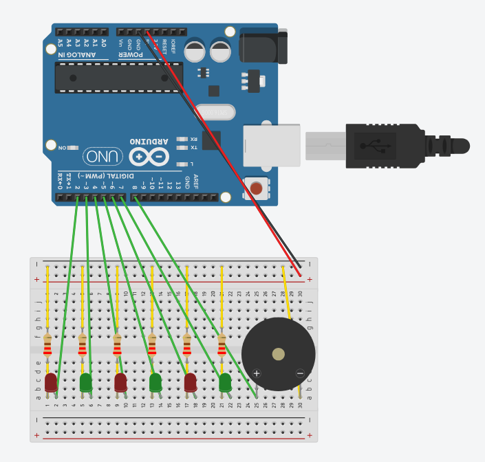

# Arduino Christmas Lights

## Overview:

Got a tangled mess of Christmas lights that you're too lazy to deal with? Then this project is for you.

This is a fun, simple project easily produced with the materials found in an Arduino Uno starter kit. It will play the first part of Jingle Bells from a piezo, accompanied by flashing red and green LED lights. It is simple, but fun to make and gives you the opportunity to show off your technical prowess to relatives at a holiday gathering.

## Material List:

- 1x Breadboard
- 1x Arduino Uno (or any other compatible board)
- 1x Passive piezo (usually found in every starter kit)
- 6x LEDs, 3 red, 3 green
- 6x 220 ohm resistors (note: If you find the piezo is too loud, wire a 220 ohm resistor between the piezo and digital pin 8.)
- Jumper wires

## Setup Guide:

Connect your components together according to the diagram below. Because this diagram was constructed in Tinkercad, the resistors are connected to their destinations via cables; this is not necessary in real life, as you can simply bend the resistor wires.

Next, download the source code at [``code.ino``](code.ino) and upload it to your Arduino using the official IDE.

Then plug the Arduino into a power source (USB port, power bank, wall outlet via adapter, etc.) and enjoy. The song will play on a loop, permanently, so unplug it when you've had enough festivities for one day.

